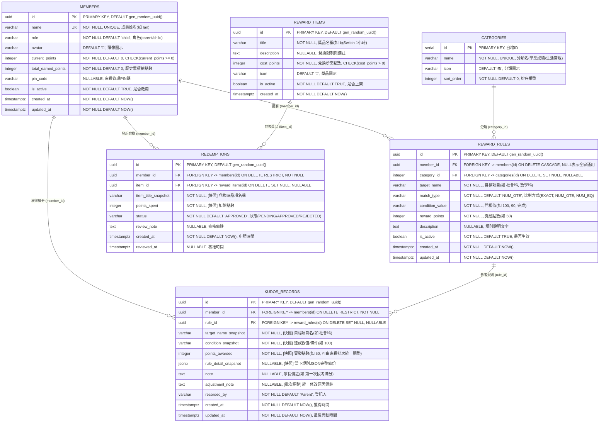
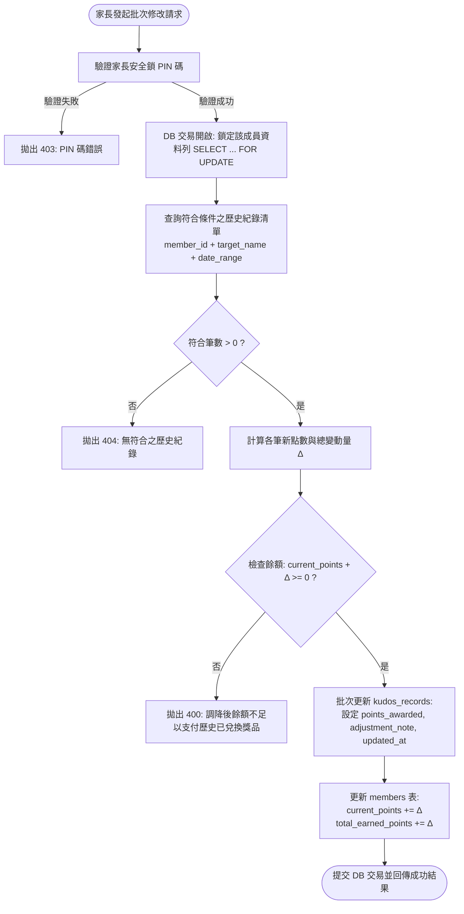

# Frog Kudos 家庭積分獎勵系統 - 系統詳細設計文件 (DESIGN.md)

本文件依據 [REQUIREMENT.md](./REQUIREMENT.md) 需求規格書，定義 **Frog Kudos 家庭積分獎勵系統** 的技術架構、PostgreSQL 資料庫實體關聯 (Mermaid ERD)、後端推導引擎演算法、RESTful API 規格以及 Vue 3 前端介面詳細設計。

---

## 1. 系統架構總覽 (System Architecture)

系統採用前後端整合部署設計，**「平日日常使用只需單一 Port」**，運行於本機 Linux 環境，使用現有的 PostgreSQL `frog_kudos` 資料庫。

### 1.1 平日日常運行架構（單一 Port 模式，預設 Port 8000）
Vue 3 前端編譯建置為靜態資源（`dist/`），由 FastAPI 後端伺服器在單一連接埠上同時託管「前端單頁應用 (SPA)」與「後端 REST API」。

```
  家庭成員裝置 (手機 / iPad / 電腦瀏覽器)
                   │
                   ▼ (單一連接埠: 例如 http://主機IP:8000)
+---------------------------------------------------------------------------------+
|                       FastAPI 整合伺服器 (Port: 8000)                            |
|                                                                                 |
|   ├── GET /api/*        ➔ RESTful APIs (業務邏輯、推導引擎、資料庫交易)            |
|   └── GET /*            ➔ StaticFiles 靜態託管 (Vue 3 SPA 單頁應用 index.html)    |
|                                                                                 |
|   ├── routers/          (成員、規則、點數發放、批次調整、商城兌換)               |
|   ├── services/         (智慧規則比對推導引擎 Rule Matching Engine)              |
|   ├── schemas/          (Pydantic v2 資料驗證與型別轉換)                         |
|   └── models/           (SQLAlchemy 2.0 Async ORM 實體)                         |
+---------------------------------------------------------------------------------+
                                      │ asyncpg 連線池 (ACID Transactions)
                                      ▼
+---------------------------------------------------------------------------------+
|                       資料庫層 (PostgreSQL: frog_kudos)                         |
|   ├── members           (家庭成員與餘額快取)                                     |
|   ├── categories        (規則與獎項分類)                                         |
|   ├── reward_rules      (成員專屬與通用獎勵規則)                                 |
|   ├── kudos_records     (核心快照流水帳 - 永久封存歷史點數與規則)                |
|   ├── reward_items      (兌換商城品項)                                           |
|   └── redemptions       (兌換核銷紀錄)                                           |
+---------------------------------------------------------------------------------+
```

- **單一 Port 優勢**：
  1. **零設定**：不需額外安裝與設定 Nginx 反向代理，家庭主機資源消耗極低。
  2. **連線便利**：家人手機或平板只要儲存一個書籤（如 `http://192.168.1.100:8000`）。
  3. **無跨域問題 (Zero CORS issues)**：API 與網頁在同源同 Port，避免跨來源請求被瀏覽器安全政策阻擋。

### 1.2 本機開發模式 (Dev Mode，雙 Port 模式)
- **前端開發伺服器**：Vite 監聽 Port `5173`，支援 HMR（模組熱更替，存檔即刷新）。
- **後端開發伺服器**：FastAPI (Uvicorn) 監聽 Port `8000`，支援自動熱重載 (Reload)。
- **Vite Proxy**：Vite 設定代理將 `/api` 請求無縫轉發至 Port `8000`。

---

## 2. 資料庫架構與 Mermaid 詳細關聯 (Database Schema)

資料庫核心設計原則：**「Append-Only 記帳與數值快照（Snapshotting）」**。
歷史發放的點數紀錄（`kudos_records`）與兌換紀錄（`redemptions`）獨立保存當下的數值與規則快照，即使 `reward_rules` 被修改或刪除，過往紀錄完全不變。

### 2.1 Mermaid 實體關聯圖 (ER Diagram)



### 2.2 外鍵約束與級聯行為說明

1. **`reward_rules.member_id` ➔ `members.id` (`ON DELETE CASCADE`)**：
   - 當成員帳號被徹底刪除時，其專屬的規則自動隨之清理。
   - `member_id` 允許為 `NULL`，代表該規則為**全家共用規則**。
2. **`kudos_records.rule_id` ➔ `reward_rules.id` (`ON DELETE SET NULL`)**：
   - 規則未來即便被刪除，歷史發放紀錄依舊完整保留，`rule_id` 僅被設為 `NULL`，不損壞歷史記帳。
3. **`kudos_records.member_id` ➔ `members.id` (`ON DELETE RESTRICT`)**：
   - 若成員已有歷史點數紀錄，禁止直接硬刪除成員，確保審計鏈完整。
4. **`kudos_records` 快照欄位組與批次調整審計**：
   - `target_name_snapshot`、`condition_snapshot`、`points_awarded`、`rule_detail_snapshot` 均為發放當下儲存值，系統預設不隨規則變動而回溯重算。
   - 當家長主動使用「批次篩選調整工具」時，系統在同一資料庫交易內更新 `points_awarded`、記錄 `adjustment_note`（調整原因）與 `updated_at`，並同步調整該成員之點數餘額，確保審計軌跡清楚透明。

---

## 3. 後端架構與 API 介面規格 (FastAPI Backend)

### 3.1 規則自動推導引擎算法 (Rule Engine Matching Flow)

當前端觸發試算：`POST /api/kudos/preview`
- **輸入**：`member_id`, `target_name` (如 "社會科"), `condition_value` (如 "100")
- **演算法流程**：
  ```mermaid
  flowchart TD
      Start([收到預覽請求: Member + Target + Value]) --> Step1[查詢 Active 規則清單]
      Step1 --> Step2{是否有符合 target_name 的專屬規則?<br>member_id == input.member_id}
      Step2 -- 是 --> MatchCustom[鎖定成員專屬候選規則]
      Step2 -- 否 --> Step3{是否有全家通用規則?<br>member_id IS NULL}
      Step3 -- 是 --> MatchGlobal[鎖定全家通用候選規則]
      Step3 -- 否 --> NoMatch[無匹配規則: 預設建議點數 0]
      
      MatchCustom --> Filter[條件門檻過濾]
      MatchGlobal --> Filter
      
      Filter --> CondType{比對 match_type}
      CondType -- NUM_GTE --> CheckNum{數值 value >= condition_value?}
      CondType -- EXACT --> CheckStr{字串相符?}
      
      CheckNum -- 符合 --> RankPoints[可能有多條符合, 取 reward_points 最高者]
      CheckStr -- 符合 --> RankPoints
      CheckNum -- 不符合 --> NoMatch
      CheckStr -- 不符合 --> NoMatch

      RankPoints --> OutputResult([回傳: matched=true, rule_id, 建議點數, 規則名稱])
  ```

### 3.2 關鍵 API 端點規格

| 方法 | 路徑 | 請求 Payload / 查詢參數 | 回應資料 | 說明 |
|---|---|---|---|---|
| `GET` | `/api/members` | - | `MemberOut[]` | 取得家庭成員清單（含即時點數） |
| `POST` | `/api/members` | `{ name, role, avatar, pin_code }` | `MemberOut` | 新增家庭成員 |
| `GET` | `/api/rules` | `?member_id=...` | `RuleOut[]` | 取得規則清單（可過濾專屬或通用） |
| `POST` | `/api/rules` | `{ member_id, target_name, match_type, condition_value, reward_points }` | `RuleOut` | 新增獎勵規則 |
| `PUT` | `/api/rules/{id}` | 規則異動欄位 | `RuleOut` | 修改規則（**明示不溯及歷史點數**） |
| `DELETE` | `/api/rules/{id}` | - | `{ success: true }` | 停用或刪除規則 |
| `POST` | `/api/kudos/preview` | `{ member_id, target_name, condition_value }` | `{ matched, suggested_points, rule_id, rule_name }` | **智慧即時試算預覽** |
| `POST` | `/api/kudos/record` | `{ member_id, rule_id, target_name, condition_value, points_awarded, note }` | `KudosRecordOut` | **正式發放點數（寫入快照與扣點）** |
| `GET` | `/api/kudos/history` | `?member_id=...&limit=50` | `KudosRecordOut[]` | 查詢點數獲得歷史流水帳 |
| `GET` | `/api/items` | - | `RewardItemOut[]` | 查詢兌換商城品項 |
| `POST` | `/api/items` | `{ title, description, cost_points, icon }` | `RewardItemOut` | 新增商城獎品 |
| `POST` | `/api/redemptions` | `{ member_id, item_id, note }` | `RedemptionOut` | **兌換獎品（扣除可用點數 Transaction）** |
| `GET` | `/api/redemptions` | `?member_id=...` | `RedemptionOut[]` | 查詢兌換與核銷歷史 |
| `POST` | `/api/kudos/batch-preview` | `{ member_id, target_name, start_date, end_date, mode, value }` | `BatchPreviewOut` | **歷史積分批次調整預覽試算** |
| `POST` | `/api/kudos/batch-adjust` | `{ member_id, target_name, start_date, end_date, mode, value, reason, parent_pin }` | `BatchAdjustOut` | **執行歷史積分批次統一調整 (ACID Transaction)** |
| `POST` | `/api/system/backup` | `{ target_path, parent_pin }` | `{ success, backup_file, file_size, created_at }` | **觸發資料庫備份至指定目標路徑** |
| `GET` | `/api/system/backups` | `?target_path=...` | `BackupFileInfo[]` | **查詢指定目錄歷史備份清單** |

### 3.3 歷史積分批次統一調整演算法與交易安全 (Batch Adjustment Logic & Safety)

當家長需要依「人員、目標項目、時間區間」統一修改過往積分時，後端執行嚴格的交易安全保障：



- **批次調整模式 (`mode`)**：
  - `FIXED`（統一設為固定值）：所有符合紀錄的 `points_awarded` 直接更新為 `value`。各筆變動量 $\Delta_i = \text{value} - \text{old\_points}_i$。
  - `OFFSET`（統一增減點數）：所有符合紀錄的 `points_awarded` 更新為 $\text{old\_points}_i + \text{value}$。各筆變動量 $\Delta_i = \text{value}$。
- **不可小於零防呆**：若調整為負變動量（向下扣減），系統嚴格保障會員的 `current_points + \Delta \ge 0`，避免破壞已完成之兌換扣點。

---

## 4. 前端 Web UI 詳細規格 (Vue 3 + TailwindCSS)

前端採用現代 Vue 3 (Composition API + `<script setup>`)，搭配 TailwindCSS 建立活潑親切的家庭 UI。全站具備完整 RWD，手機與平板操作體驗極佳。

### 4.1 頁面架構與導航設計
- **頂部 Header**：
  - 左側：🐸 **Frog Kudos** 系統 Logo 與品牌名稱。
  - 右側：快速切換目前使用者身份、家長安全鎖圖示（進入後台需驗證 PIN）。
- **主要導航 (Navigation Tabs)**：
  1. 📝 **快速登記 (Record)**
  2. 🏆 **榮譽榜與存摺 (Ledger)**
  3. 🎁 **兌換商城 (Rewards Shop)**
  4. ⚙️ **規則管理 (Rule Settings)**

---

### 4.2 畫面 1：快速成就登記 (Quick Kudos Entry Form)

最頻繁使用的操作介面，以高對比卡片呈現，支援即時試算與成就反饋。

```
+-------------------------------------------------------------------------+
|  🐸 Frog Kudos                                      [ 爸比 (家長) ⚙️ ]  |
+-------------------------------------------------------------------------+
|                                                                         |
|  第一步：選擇成就對象                                                   |
|  +--------------------+  +--------------------+  +-------------------+  |
|  |  [ 🐸 Ian ]        |  |  [ 👧 Amy ]        |  |  [ + 新增成員 ]   |  |
|  |  餘額: 180 點 (選定)|  |  餘額: 95 點       |  |                   |  |
|  +--------------------+  +--------------------+  +-------------------+  |
|                                                                         |
|  第二步：輸入成就資料                                                   |
|  ┌───────────────────────────────────────────────────────────────────┐  |
|  │ 目標項目 (Target)                                                  │  |
|  │ [ 社會科                                                    ▼ ]   │  |
|  │ (可下拉快速選取現有科目，或直接打字搜尋)                          │  |
|  │                                                                   │  |
|  │ 達成狀況/分數 (Condition)                                         │  |
|  │ [ 100                                                       ] 分  │  |
|  └───────────────────────────────────────────────────────────────────┘  |
|                                                                         |
|  ▼ 系統即時比對反饋 (Live Preview Badge)                                |
|  ┌───────────────────────────────────────────────────────────────────┐  |
|  │ 🌟 命中規則：【Ian 專屬規則】社會科段考滿分獎勵                   │  |
|  │ 🎁 系統建議獎勵：[ +50 ] 點  (家長可點擊數字直接進行微調)         │  |
|  └───────────────────────────────────────────────────────────────────┘  |
|                                                                         |
|  第三步：補充說明                                                       |
|  [ 第一次段考社會科成績單公布                                    ]      |
|                                                                         |
|  +-------------------------------------------------------------------+  |
|  |                🎉 確認發放 50 點獎勵積分 (Submit)                 |  |
|  +-------------------------------------------------------------------+  |
|                                                                         |
+-------------------------------------------------------------------------+
```

#### 互動與視覺反饋細節：
1. **成員卡片動態選取**：點選 Ian 時，卡片放大浮起並帶綠色光暈（Frog Green）。
2. **防呆自動聯想**：在目標項目鍵入「社」，即時出現 `社會科` 快捷標籤可點擊。
3. **即時推導（Debounce 300ms）**：當「社會科」與「100」填寫完成，自動呼叫 `/api/kudos/preview`，即時渲染帶有彈跳淡入動畫的綠色徽章，顯示「+50 點」。
4. **成就慶祝效果**：按下【確認發放】成功時，畫面噴灑 **Canvas Confetti（全螢幕彩帶灑花）**，並播放清脆的金幣音效（可靜音），彈出 Toast 提示「已為 Ian 增加 50 點！目前累積 230 點」。

---

### 4.3 畫面 2：家庭榮譽榜與點數存摺 (Family Dashboard & Ledger)

清晰呈現孩子累積的成果與每一筆歷史快照。

```
+-------------------------------------------------------------------------+
|  🏆 家庭榮譽存摺                                                        |
+-------------------------------------------------------------------------+
|  [ 🐸 Ian 的存摺 ]      目前可用: 🪙 230 點     歷史累計總獲: 🌟 480 點  |
|  進度條: [████████████████░░░░] 距下一個大獎 (樂高模型 300 點) 還差 70點 |
+-------------------------------------------------------------------------+
|  點數歷史流水帳 (Immutable Ledger)                                      |
|                                                                         |
|  • 2026-09-27 22:45 | 社會科 (100分)                     [ +50 點 ] 🟢  |
|    備註: 第一次段考滿分 | 登記人: Dad                                   |
|    快照細節: 命中當時規則「Ian 專屬 - 社會科滿分 (條件: >=100, 點數: 50)」 |
|                                                                         |
|  • 2026-09-25 18:20 | 整理房間 (完成)                    [ +10 點 ] 🟢  |
|    備註: 玩具收拾整齊 | 登記人: Mom                                     |
|                                                                         |
|  • 2026-09-24 15:00 | 兌換: 週末玩 Switch 1小時          [ -50 點 ] 🔴  |
|    狀態: 已核銷使用 | 審核人: Dad                                       |
+-------------------------------------------------------------------------+
```

---

### 4.4 畫面 3：獎勵兌換商城 (Kudos Rewards Shop)

孩子將努力成果兌現的夢想清單，實現「設定目標 ➔ 努力達成 ➔ 兌換反饋」的正向循環。

```
+-------------------------------------------------------------------------+
|  🎁 獎勵兌換商城                 [ Ian 目前點數錢包: 🪙 230 點 ]        |
+-------------------------------------------------------------------------+
|                                                                         |
|  +------------------------+   +------------------------+                |
|  | 🎮 玩 Switch 1 小時    |   | 🍦 週末吃冰淇淋一球    |                |
|  | 所需點數: 50 點         |   | 所需點數: 30 點         |                |
|  | 說明: 限週末完成作業後  |   | 說明: 任何口味皆可     |                |
|  | [   🟢 立即申請兌換  ] |   | [   🟢 立即申請兌換  ] |                |
|  +------------------------+   +------------------------+                |
|                                                                         |
|  +------------------------+   +------------------------+                |
|  | 📚 自選課外讀物 1 本   |   | 🤖 樂高機械人組        |                |
|  | 所需點數: 100 點        |   | 所需點數: 300 點        |                |
|  | 說明: 假日至書店挑選   |   | 說明: 達成學期大目標   |                |
|  | [   🟢 立即申請兌換  ] |   | [ 🔒 還差 70 點 (鎖定) ]|                |
|  +------------------------+   +------------------------+                |
|                                                                         |
+-------------------------------------------------------------------------+
```

#### 兌換流程與交易防呆：
1. **點數檢核**：若成員可用點數不足（例如 Ian 有 230 點，想兌換 300 點品項），按鈕呈現反灰鎖定狀態，顯示「還差 70 點」，防止超兌。
2. **兌換確認彈窗**：點擊【立即申請兌換】時彈出確認對話框：「確定要消耗 50 點兌換『玩 Switch 1 小時』嗎？兌換後剩餘 180 點」。
3. **原子扣點**：後端採用資料庫 Transaction，扣除 `members.current_points` 同步新增 `redemptions` 紀錄。

---

### 4.5 畫面 4：規則管理中心 (Rule Settings)

家長管理各成員規則的後台，明確告知「規則不溯及既往」原則。

```
+-------------------------------------------------------------------------+
|  ⚙️ 獎勵規則設定中心                                                    |
|  ℹ️ 重要提醒：在此修改或刪除規則，只會影響「未來」的新成就，過往已發放的  |
|     點數紀錄已永久快照存檔，絕不會被修改。                              |
+-------------------------------------------------------------------------+
|  規則對象切換: [ 🐸 Ian 專屬 (3) ]  [ 👧 Amy 專屬 (2) ]  [ 🌐 全家通用 (5) ]  |
+-------------------------------------------------------------------------+
|  目前規則列表 (Ian 專屬):                                               |
|                                                                         |
|  • 社會科 | 門檻: >= 100 分  | 獎勵: +50 點  | 狀態: [啟用中]  [編輯] [停用]|
|  • 社會科 | 門檻: >= 90 分   | 獎勵: +20 點  | 狀態: [啟用中]  [編輯] [停用]|
|  • 數學科 | 門檻: >= 100 分  | 獎勵: +50 點  | 狀態: [啟用中]  [編輯] [停用]|
|                                                                         |
|  [ + 為 Ian 新增專屬規則 ]                                              |
+-------------------------------------------------------------------------+
```

---

### 4.6 畫面 5：歷史積分批次篩選與調整工具 (Batch Points Adjuster Modal)

專為家長提供的管理審計工具，整合於「榮譽榜與存摺」右上角之【🛠 批次調整歷史積分】。

```
+-------------------------------------------------------------------------+
|  🛠 批次調整歷史積分 (家長管理工具)                                     |
|  說明：此功能將依篩選條件「統一批次修改」歷史已發放的點數紀錄並同步更新餘額。|
+-------------------------------------------------------------------------+
|  1. 篩選對象 (Member):    [ 🐸 Ian                                ▼ ]   |
|  2. 目標項目 (Target):    [ 社會科                                ▼ ]   |
|  3. 時間區間 (Date Range):[ 2026-09-01 ] 至 [ 2026-09-27 ]              |
|                                                                         |
|  4. 調整模式 (Mode):                                                    |
|     (•) 統一設為固定新點數: 每筆設為 [ 60 ] 點                          |
|     ( ) 統一增減點數:       每筆 [ +10 ] 點                             |
|                                                                         |
|  5. 調整原因 (Reason):    [ 九月份社會科加碼獎勵補發                      ]  |
|                                                                         |
|  [ 🔍 試算影響範圍 (Preview) ]                                          |
|  ┌───────────────────────────────────────────────────────────────────┐  |
|  │ 📊 試算結果：                                                     │  |
|  │ • 符合歷史紀錄：共 3 筆                                           │  |
|  │ • 原發放總點數：150 點 (50 + 50 + 50)                             │  |
|  │ • 調整後總點數：180 點 (60 + 60 + 60)                             │  |
|  │ • 預計變動差額 (Δ)：+30 點 (Ian 餘額將由 230 點變為 260 點)        │  |
|  │ ───────────────────────────────────────────────────────────────── │  |
|  │ 明細預覽:                                                         │  |
|  │  1. 2026-09-10 | 社會科 (100分) : 50 點 ➔ 60 點                   │  |
|  │  2. 2026-09-18 | 社會科 (100分) : 50 點 ➔ 60 點                   │  |
|  │  3. 2026-09-27 | 社會科 (100分) : 50 點 ➔ 60 點                   │  |
|  └───────────────────────────────────────────────────────────────────┘  |
|                                                                         |
|  請輸入家長 PIN 碼: [ **** ]                                            |
|                                                                         |
|  [ 取消 ]                          [ ⚠️ 確認執行批次調整 (+30 點) ]     |
+-------------------------------------------------------------------------+
```

---

### 4.7 畫面 6：系統維運與資料庫備份中心 (System Backup & Maintenance Modal)

家長可在右上角齒輪選單點選【💾 系統備份與維運】，提供可指定目標路徑的備份操作與歷史備份清單。

```
+-------------------------------------------------------------------------+
|  💾 系統備份與資料庫維運 (家長專區)                                     |
+-------------------------------------------------------------------------+
|  1. 自訂備份目的地路徑:                                                 |
|     [ /home/chinsonyeh/Code/frog_kudos/backups                    ]     |
|     (可修改為自訂目錄、外接硬碟或 NAS 掛載路徑)                         |
|                                                                         |
|  2. 家長管理 PIN 碼: [ **** ]                                           |
|                                                                         |
|  [ 📦 立即建立資料庫完整備份 ]                                          |
|  ┌───────────────────────────────────────────────────────────────────┐  |
|  │ ✅ 備份成功！檔案: frog_kudos_backup_20260927_232500.dump (42 KB) │  |
|  └───────────────────────────────────────────────────────────────────┘  |
|                                                                         |
|  📁 歷史備份檔案清單:                                                   |
|  ┌───────────────────────────────────────────────────────────────────┐  |
|  │ • 2026-09-27 23:25 | frog_kudos_backup_20260927_232500.dump (42 KB)│  |
|  │ • 2026-09-26 18:00 | frog_kudos_backup_20260926_180000.dump (38 KB)│  |
|  └───────────────────────────────────────────────────────────────────┘  |
|                                                                         |
|  💡 資料庫還原提示：                                                    |
|     如需還原備份，為確保安全，請於伺服器終端機執行安全還原腳本：        |
|     $ ./scripts/restore.sh <備份檔案絕對路徑>                            |
|                                                                         |
|  [ 關閉 ]                                                               |
+-------------------------------------------------------------------------+
```

---

## 5. PostgreSQL DDL 建表腳本 (預備執行腳本)

本腳本規劃於審查通過後，在 `frog_kudos` 資料庫中執行：

```sql
-- 1. 啟用 UUID 擴充功能
CREATE EXTENSION IF NOT EXISTS "pgcrypto";

-- 2. 成員表
CREATE TABLE IF NOT EXISTS members (
    id UUID PRIMARY KEY DEFAULT gen_random_uuid(),
    name VARCHAR(50) NOT NULL UNIQUE,
    role VARCHAR(20) NOT NULL DEFAULT 'child',
    avatar VARCHAR(100) DEFAULT '🐸',
    current_points INTEGER NOT NULL DEFAULT 0 CHECK (current_points >= 0),
    total_earned_points INTEGER NOT NULL DEFAULT 0 CHECK (total_earned_points >= 0),
    pin_code VARCHAR(60),
    is_active BOOLEAN NOT NULL DEFAULT TRUE,
    created_at TIMESTAMPTZ NOT NULL DEFAULT NOW(),
    updated_at TIMESTAMPTZ NOT NULL DEFAULT NOW()
);

-- 3. 分類表
CREATE TABLE IF NOT EXISTS categories (
    id SERIAL PRIMARY KEY,
    name VARCHAR(50) NOT NULL UNIQUE,
    icon VARCHAR(50) DEFAULT '📚',
    sort_order INTEGER NOT NULL DEFAULT 0
);

-- 4. 獎勵規則表 (支援特定成員或全家通用)
CREATE TABLE IF NOT EXISTS reward_rules (
    id UUID PRIMARY KEY DEFAULT gen_random_uuid(),
    member_id UUID REFERENCES members(id) ON DELETE CASCADE,
    category_id INTEGER REFERENCES categories(id) ON DELETE SET NULL,
    target_name VARCHAR(100) NOT NULL,
    match_type VARCHAR(20) NOT NULL DEFAULT 'NUM_GTE', -- 'NUM_GTE', 'NUM_EQ', 'EXACT'
    condition_value VARCHAR(50) NOT NULL,
    reward_points INTEGER NOT NULL CHECK (reward_points >= 0),
    description TEXT,
    is_active BOOLEAN NOT NULL DEFAULT TRUE,
    created_at TIMESTAMPTZ NOT NULL DEFAULT NOW(),
    updated_at TIMESTAMPTZ NOT NULL DEFAULT NOW()
);

-- 5. 點數獲得快照紀錄表 (核心快照，不可溯及修改，支援家長批次統一調整)
CREATE TABLE IF NOT EXISTS kudos_records (
    id UUID PRIMARY KEY DEFAULT gen_random_uuid(),
    member_id UUID NOT NULL REFERENCES members(id) ON DELETE RESTRICT,
    rule_id UUID REFERENCES reward_rules(id) ON DELETE SET NULL,
    target_name_snapshot VARCHAR(100) NOT NULL,
    condition_snapshot VARCHAR(100) NOT NULL,
    points_awarded INTEGER NOT NULL,
    rule_detail_snapshot JSONB,
    note TEXT,
    adjustment_note TEXT,
    recorded_by VARCHAR(50) NOT NULL DEFAULT 'Parent',
    created_at TIMESTAMPTZ NOT NULL DEFAULT NOW(),
    updated_at TIMESTAMPTZ NOT NULL DEFAULT NOW()
);

-- 6. 兌換商城品項表
CREATE TABLE IF NOT EXISTS reward_items (
    id UUID PRIMARY KEY DEFAULT gen_random_uuid(),
    title VARCHAR(100) NOT NULL,
    description TEXT,
    cost_points INTEGER NOT NULL CHECK (cost_points > 0),
    icon VARCHAR(50) DEFAULT '🎁',
    is_active BOOLEAN NOT NULL DEFAULT TRUE,
    created_at TIMESTAMPTZ NOT NULL DEFAULT NOW()
);

-- 7. 兌換紀錄表
CREATE TABLE IF NOT EXISTS redemptions (
    id UUID PRIMARY KEY DEFAULT gen_random_uuid(),
    member_id UUID NOT NULL REFERENCES members(id) ON DELETE RESTRICT,
    item_id UUID REFERENCES reward_items(id) ON DELETE SET NULL,
    item_title_snapshot VARCHAR(100) NOT NULL,
    points_spent INTEGER NOT NULL CHECK (points_spent > 0),
    status VARCHAR(20) NOT NULL DEFAULT 'APPROVED', -- 'PENDING', 'APPROVED', 'REJECTED'
    review_note TEXT,
    created_at TIMESTAMPTZ NOT NULL DEFAULT NOW(),
    reviewed_at TIMESTAMPTZ
);

-- 8. 效能索引
CREATE INDEX IF NOT EXISTS idx_rules_member_active ON reward_rules(member_id, is_active);
CREATE INDEX IF NOT EXISTS idx_kudos_records_member_created ON kudos_records(member_id, created_at DESC);
CREATE INDEX IF NOT EXISTS idx_kudos_batch_filter ON kudos_records(member_id, target_name_snapshot, created_at);
CREATE INDEX IF NOT EXISTS idx_redemptions_member_created ON redemptions(member_id, created_at DESC);
```

---

## 6. 資料庫備份、還原與維運自動化腳本 (Backup, Restore, Install & Upgrade)

本系統提供獨立的維運腳本目錄 `scripts/`，並在前端家長後台提供 UI 操作介面，支援**指定備份目標路徑**、安全還原、一鍵安裝與平滑升級。

### 6.1 資料庫指定路徑備份機制 (`scripts/backup.sh`)
- **功能**：使用 PostgreSQL 原生 `pg_dump` 建立高壓縮 Custom 格式（`.dump`）備份檔。
- **自訂目標路徑**：支援命令列傳入目標目錄（若未傳入則讀取 `.env` 中的 `BACKUP_DIR`，預設為專案目錄下之 `backups/`）。
- **腳本內容設計**：
```bash
#!/usr/bin/env bash
set -euo pipefail

# 載入環境變數
ROOT_DIR="$(cd "$(dirname "$0")/.." && pwd)"
ENV_FILE="$ROOT_DIR/.env"
if [ -f "$ENV_FILE" ]; then
    export $(grep -v '^#' "$ENV_FILE" | xargs)
fi

DB_NAME="${DB_NAME:-frog_kudos}"
DB_USER="${DB_USER:-postgres}"
DB_HOST="${DB_HOST:-localhost}"
DB_PORT="${DB_PORT:-5432}"

# 取得指定目標路徑 (第 1 個引數)，若無指定則預設讀取 BACKUP_DIR 或 $ROOT_DIR/backups
TARGET_DIR="${1:-${BACKUP_DIR:-$ROOT_DIR/backups}}"
mkdir -p "$TARGET_DIR"

TIMESTAMP=$(date +"%Y%m%d_%H%M%S")
BACKUP_FILE="${TARGET_DIR}/frog_kudos_backup_${TIMESTAMP}.dump"

echo "📦 開始備份資料庫 [${DB_NAME}] 至目標路徑: ${BACKUP_FILE} ..."
pg_dump -h "$DB_HOST" -p "$DB_PORT" -U "$DB_USER" -Fc "$DB_NAME" > "$BACKUP_FILE"

FILE_SIZE=$(du -h "$BACKUP_FILE" | cut -f1)
echo "✅ 備份成功！檔案大小: ${FILE_SIZE}"
echo "📍 完整備份路徑: ${BACKUP_FILE}"
```

### 6.2 資料庫安全還原腳本 (`scripts/restore.sh`)
- **功能**：使用 `pg_restore` 還原資料庫，具備**前置安全快照**與**二次輸入確認**機制。
- **腳本內容設計**：
```bash
#!/usr/bin/env bash
set -euo pipefail

ROOT_DIR="$(cd "$(dirname "$0")/.." && pwd)"

if [ -z "${1:-}" ]; then
    echo "❌ 錯誤: 請指定要還原的備份檔案路徑！"
    echo "使用範例: ./scripts/restore.sh /path/to/frog_kudos_backup_20260927_120000.dump"
    exit 1
fi

BACKUP_FILE="$1"
if [ ! -f "$BACKUP_FILE" ]; then
    echo "❌ 找不到備份檔案: $BACKUP_FILE"
    exit 1
fi

ENV_FILE="$ROOT_DIR/.env"
if [ -f "$ENV_FILE" ]; then
    export $(grep -v '^#' "$ENV_FILE" | xargs)
fi

DB_NAME="${DB_NAME:-frog_kudos}"
DB_USER="${DB_USER:-postgres}"
DB_HOST="${DB_HOST:-localhost}"
DB_PORT="${DB_PORT:-5432}"

echo "⚠️  【危險警告】即將把備份檔案還原至資料庫 [${DB_NAME}]！"
echo "⚠️  現有所有資料將會被該備份覆蓋！"
echo "備份檔案: $BACKUP_FILE"
read -p "確定要繼續執行還原嗎？(請輸入 YES 確認): " CONFIRM
if [ "$CONFIRM" != "YES" ]; then
    echo "🛑 已取消還原作業。"
    exit 0
fi

# 1. 還原前自動建立安全快照，避免誤操作
SNAPSHOT_DIR="${BACKUP_DIR:-$ROOT_DIR/backups}"
mkdir -p "$SNAPSHOT_DIR"
PRE_RESTORE_BACKUP="${SNAPSHOT_DIR}/pre_restore_snapshot_$(date +"%Y%m%d_%H%M%S").dump"
echo "🛡️ 正在建立還原前安全快照: ${PRE_RESTORE_BACKUP} ..."
pg_dump -h "$DB_HOST" -p "$DB_PORT" -U "$DB_USER" -Fc "$DB_NAME" > "$PRE_RESTORE_BACKUP" || true

# 2. 執行還原 (使用 --clean --if-exists 清除舊表後乾淨恢復)
echo "🔄 開始執行資料庫還原..."
pg_restore -h "$DB_HOST" -p "$DB_PORT" -U "$DB_USER" -d "$DB_NAME" --clean --if-exists "$BACKUP_FILE"

echo "✅ 資料庫還原成功！已恢復至備份時間點。"
```

### 6.3 系統一鍵安裝腳本 (`scripts/install.sh`)
- **功能**：自動檢查主機 Python/Node/PostgreSQL 環境、初始化資料庫、建置 Python 虛擬環境、打包前端並生成單一 Port 啟動器。
- **腳本內容設計**：
```bash
#!/usr/bin/env bash
set -euo pipefail

ROOT_DIR="$(cd "$(dirname "$0")/.." && pwd)"
echo "🚀 開始執行 Frog Kudos 家庭積分獎勵系統自動化安裝..."

# 1. 檢查主機環境相依工具
echo "🔍 步驟 1/5: 檢查主機環境..."
command -v python3 >/dev/null 2>&1 || { echo "❌ 缺少 python3，請先安裝 Python 3.12+"; exit 1; }
command -v node >/dev/null 2>&1 || { echo "❌ 缺少 node，請先安裝 Node.js 18+"; exit 1; }
command -v npm >/dev/null 2>&1 || { echo "❌ 缺少 npm"; exit 1; }
command -v psql >/dev/null 2>&1 || { echo "❌ 缺少 psql，請先安裝 postgresql-client"; exit 1; }
command -v pg_dump >/dev/null 2>&1 || { echo "❌ 缺少 pg_dump"; exit 1; }

# 2. 建立 .env 設定檔
if [ ! -f "$ROOT_DIR/.env" ]; then
    echo "📝 步驟 2/5: 建立預設環境設定檔 (.env)..."
    cat << 'EOF' > "$ROOT_DIR/.env"
DATABASE_URL=postgresql+asyncpg://postgres@localhost:5432/frog_kudos
DB_NAME=frog_kudos
DB_USER=postgres
DB_HOST=localhost
DB_PORT=5432
PORT=8000
BACKUP_DIR=/home/chinsonyeh/Code/frog_kudos/backups
PARENT_DEFAULT_PIN=0000
EOF
fi

# 3. 初始化 PostgreSQL frog_kudos 資料庫結構
echo "🐘 步驟 3/5: 初始化資料庫結構..."
psql -U postgres -d frog_kudos -f "$ROOT_DIR/schema.sql"

# 4. 建置後端 Python 虛擬環境
echo "🐍 步驟 4/5: 建置 Python 虛擬環境並安裝依賴..."
cd "$ROOT_DIR"
if [ ! -d "venv" ]; then
    python3 -m venv venv
fi
source venv/bin/activate
pip install --upgrade pip
pip install -r requirements.txt

# 5. 前端相依安裝與打包編譯 (支援單一 Port 託管)
echo "🎨 步驟 5/5: 安裝前端套件並編譯生產環境資源 (npm run build)..."
cd "$ROOT_DIR/frontend"
npm install
npm run build

echo "🎉 Frog Kudos 安裝完成！"
echo "👉 執行 ./run.sh 即可啟動系統 (瀏覽器開啟: http://localhost:8000)"
```

### 6.4 系統平滑升級腳本 (`scripts/upgrade.sh`)
- **功能**：自動備份、拉取新代碼、更新套件、資料庫 Migration、重編前端並無縫重啟。
- **腳本內容設計**：
```bash
#!/usr/bin/env bash
set -euo pipefail

ROOT_DIR="$(cd "$(dirname "$0")/.." && pwd)"
echo "🔄 開始進行 Frog Kudos 系統自動化升級..."

# 1. 升級前強制備份
echo "📦 步驟 1/5: 執行升級前強制資料庫備份..."
"$ROOT_DIR/scripts/backup.sh"

# 2. 拉取最新代碼
echo "📥 步驟 2/5: 拉取最新代碼 (git pull)..."
cd "$ROOT_DIR"
git pull origin master

# 3. 更新 Python 套件
echo "🐍 步驟 3/5: 更新後端套件依賴..."
source "$ROOT_DIR/venv/bin/activate"
pip install -r requirements.txt

# 4. 資料庫 Migration (若有資料庫欄位更新)
echo "🐘 步驟 4/5: 執行資料庫結構更新..."
python -m app.migrate || true

# 5. 重新建置前端靜態資源
echo "🎨 步驟 5/5: 重新編譯前端靜態資源..."
cd "$ROOT_DIR/frontend"
npm install
npm run build

echo "✨ 升級完成！請重啟服務或執行 ./run.sh"
```

---

## 7. 總結與後續實作準備

本架構設計文件完整落實：
1. **主機 PostgreSQL `frog_kudos` 資料庫設計**：清楚標明 PK、FK 關聯約束、快照儲存與防負數 Check 限制。
2. **前後端技術定案**：採用 **Python FastAPI** + **Vue 3 (Composition API + TailwindCSS)**。
3. **單一 Port 整合運行**：平日家庭日常使用由 FastAPI 在單一連接埠（預設 Port 8000）同時提供 Vue 3 SPA 網頁與 RESTful APIs，家庭裝置連線最簡便。
4. **Web UI 詳細規格**：包含快速登記、即時試算動畫反饋、兌換商城、不可篡改存摺、歷史批次調整工具與規則管理中心。
5. **完整維運自動化**：包含指定路徑資料庫備份 (`backup.sh`)、安全還原 (`restore.sh`)、一鍵安裝 (`install.sh`) 與平滑升級 (`upgrade.sh`)。

計畫已就緒，待您確認審查通過後，我們將立即從 **Phase 1（建立資料庫結構與初始種子資料）** 正式開始實作。
