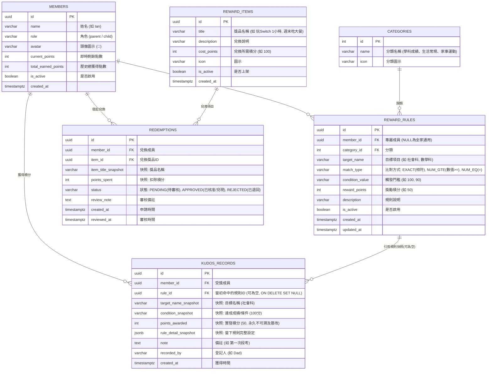

# Frog Kudos 家庭積分獎勵系統 - 系統規劃與設計計畫書 (v2)

## 1. 系統目標與核心概念

**Frog Kudos** 是一套專為家庭設計的積分與獎勵激勵系統。透過量化目標（如學業成績、生活常規、家事協助）給予成員正向激勵，並建立「賺取積分 ➔ 兌換獎勵」的正向循環閉環。

### 核心設計原則
1. **多帳號獨立規則**：每位成員可享有專屬獎勵標準（如 Ian 的科目成績標準與生活目標），亦可繼承全家通用規則。
2. **智慧帶出（Auto-calc Preview）**：輸入「成員」+「目標項目」+「達成數值」時，後端即時推導並帶出建議積分。
3. **積分快照保存（Point & Rule Snapshotting）**：**絕對不溯及既往原則**。規則可能隨時間或年級調升，但歷史紀錄必須以快照（Snapshot）永久保存當時的點數與規則，確保過往歷史不可篡改。
4. **兌換機制（Redemption Loop）**：支援建立家庭專屬的獎勵商城，孩子可使用累積點數申請兌換獎勵，家長審核核銷，實現獎勵閉環。

---

## 2. 前端技術比較與評估 (Vue 3 vs React)

依您的提問，以下針對家庭應用的情境詳細比較兩者：

| 評估維度 | Vue 3 (Composition API + Vite) | React (Vite + Hooks) |
|---|---|---|
| **架構風格** | **SFC (單一檔案組件 `.vue`)**<br>HTML Template、Script、CSS 區塊劃分清晰，直觀易讀。 | **JSX (All-in-JS)**<br>HTML 混合在 JS 中，靈活性極高，邏輯表達能力強。 |
| **響應式機制** | **Proxy-based 自動追蹤**<br>使用 `ref()` / `reactive()`，修改變數即自動更新畫面，無閉包陷阱。 | **不可變性 (Immutability)**<br>使用 `useState`、`useEffect`，需管理相依陣列 (`deps`)，容易有重渲染或閉包陷阱。 |
| **學習與維護成本** | **低至中**<br>官方生態統一（Vue Router, Pinia），程式碼簡潔直覺，家庭自架專案後續維護最省心。 | **中至高**<br>社群生態龐大但選擇多元（狀態管理有 Zustand/Redux 等），語法細節較多。 |
| **UI 元件生態** | 生態成熟健全（如 TailwindCSS、PrimeVue、DaisyUI），美觀且輕量。 | 生態最龐大（如 TailwindCSS、Radix UI、Shadcn UI、Lucide-react），設計感精緻。 |
| **家庭專案建議** | **推薦度：⭐⭐⭐⭐⭐ (最推薦)**<br>非常適合個人/家庭專案，開發迅速、除錯直觀、沒有多餘心智負擔。 | **推薦度：⭐⭐⭐⭐**<br>若偏好現代極客風格 (Shadcn UI) 或日後有 React 生態擴充考量時的首選。 |

> **建議總結**：兩者都能完美達成需求。若希望**架構最直覺、代碼好維護、輕巧易讀**，強烈推薦 **Vue 3 + TailwindCSS**；若平常偏好 React 生態語法，我們亦可使用 **React + TailwindCSS** 建置。

---

## 3. 資料庫架構設計 (PostgreSQL: `frog_kudos`)

針對「獲得積分」與「兌換獎品」，採用**完整記帳本（Double-entry inspired Ledger）**概念，確保每一筆點數來源與去向皆有跡可循。

### 3.1 實體關聯圖 (ER Diagram)



### 3.2 資料表詳細定義

#### 1. `members` (家庭成員)
| 欄位名稱 | 型別 | 限制 | 說明 |
|---|---|---|---|
| `id` | UUID | PK, DEFAULT gen_random_uuid() | 成員唯一代碼 |
| `name` | VARCHAR(50) | NOT NULL, UNIQUE | 姓名（如 "Ian", "Dad"） |
| `role` | VARCHAR(20) | NOT NULL DEFAULT 'child' | 角色：`parent`（管理者） / `child`（一般成員） |
| `avatar` | VARCHAR(100) | DEFAULT '🐸' | 頭像或 Emoji |
| `current_points` | INT | NOT NULL DEFAULT 0 | 目前可用剩餘點數（具備防負數檢核） |
| `total_earned_points` | INT | NOT NULL DEFAULT 0 | 歷史累計賺取點數（榮譽榜使用） |
| `pin_code` | VARCHAR(60) | NULL | 家長管理 PIN 碼 |
| `is_active` | BOOLEAN | NOT NULL DEFAULT TRUE | 是否啟用 |
| `created_at` | TIMESTAMPTZ | NOT NULL DEFAULT NOW() | 建立時間 |

#### 2. `reward_rules` (獎勵規則表)
支援**特定成員客製化**與**全家通用**規則：
| 欄位名稱 | 型別 | 限制 | 說明 |
|---|---|---|---|
| `id` | UUID | PK, DEFAULT gen_random_uuid() | 規則 ID |
| `member_id` | UUID | FK -> `members(id)` NULLABLE | `NULL` 代表全家通用；有指定則為該成員專屬 |
| `category_id` | INT | FK -> `categories(id)` | 類別（學科、生活常規） |
| `target_name` | VARCHAR(100) | NOT NULL | 目標名稱（如「社會科」、「數學科」） |
| `match_type` | VARCHAR(20) | NOT NULL DEFAULT 'NUM_GTE' | `NUM_GTE` (>=), `NUM_EQ` (=), `EXACT` (字串完全相符) |
| `condition_value` | VARCHAR(50) | NOT NULL | 觸發閥值（如 "100", "90"） |
| `reward_points` | INT | NOT NULL | 獎勵積分（如 50） |
| `description` | TEXT | | 規則備註說明 |
| `is_active` | BOOLEAN | NOT NULL DEFAULT TRUE | 是否啟用 |
| `created_at` | TIMESTAMPTZ | NOT NULL DEFAULT NOW() | 建立時間 |
| `updated_at` | TIMESTAMPTZ | NOT NULL DEFAULT NOW() | 更新時間 |

#### 3. `kudos_records` (點數獲得流水快照表 - 關鍵核心)
**快照機制核心**：不透過關聯計算過往點數，所有條件與給點均為不可篡改的靜態快照。
| 欄位名稱 | 型別 | 限制 | 說明 |
|---|---|---|---|
| `id` | UUID | PK, DEFAULT gen_random_uuid() | 紀錄 ID |
| `member_id` | UUID | FK -> `members(id)` NOT NULL | 受獎成員 |
| `rule_id` | UUID | FK -> `reward_rules(id)` NULLABLE, ON DELETE SET NULL | 原始引用規則 ID |
| `target_name_snapshot` | VARCHAR(100) | NOT NULL | **快照：目標名稱**（如 "社會科"） |
| `condition_snapshot` | VARCHAR(100) | NOT NULL | **快照：達成數值**（如 "100"） |
| `points_awarded` | INT | NOT NULL | **快照：實際發放點數**（如 50，永久固定） |
| `rule_detail_snapshot` | JSONB | | **快照：當下規則完整設定檔** |
| `note` | TEXT | | 自訂備註（如「第一次段考」） |
| `recorded_by` | VARCHAR(50) | NOT NULL | 登記人（如 "Dad"） |
| `created_at` | TIMESTAMPTZ | NOT NULL DEFAULT NOW() | 建立時間 |

#### 4. `reward_items` (可兌換獎勵商城品項)
| 欄位名稱 | 型別 | 限制 | 說明 |
|---|---|---|---|
| `id` | UUID | PK, DEFAULT gen_random_uuid() | 獎品 ID |
| `title` | VARCHAR(100) | NOT NULL | 獎勵名稱（如「Switch 遊戲時間 1 小時」） |
| `description` | TEXT | | 說明與兌換限制 |
| `cost_points` | INT | NOT NULL | 所需積分（如 100） |
| `icon` | VARCHAR(50) | DEFAULT '🎁' | 圖示代碼 |
| `is_active` | BOOLEAN | NOT NULL DEFAULT TRUE | 是否上架開放兌換 |
| `created_at` | TIMESTAMPTZ | NOT NULL DEFAULT NOW() | 建立時間 |

#### 5. `redemptions` (兌換申請與核銷紀錄表)
| 欄位名稱 | 型別 | 限制 | 說明 |
|---|---|---|---|
| `id` | UUID | PK, DEFAULT gen_random_uuid() | 兌換紀錄 ID |
| `member_id` | UUID | FK -> `members(id)` NOT NULL | 申請成員 |
| `item_id` | UUID | FK -> `reward_items(id)` NULLABLE | 獎品項目 |
| `item_title_snapshot` | VARCHAR(100) | NOT NULL | **快照：兌換獎品名稱** |
| `points_spent` | INT | NOT NULL | **快照：扣除點數** |
| `status` | VARCHAR(20) | NOT NULL DEFAULT 'APPROVED' | `PENDING` (待核銷), `APPROVED` (已核准), `REJECTED` (拒絕退點) |
| `review_note` | TEXT | | 備註（如「已兌現，本週末打 Switch」） |
| `created_at` | TIMESTAMPTZ | NOT NULL DEFAULT NOW() | 申請時間 |
| `reviewed_at` | TIMESTAMPTZ | | 審核時間 |

---

## 4. 後端架構設計 (Backend Architecture)

### 4.1 技術方案
- **後端環境**：Python 3.12 + **FastAPI**
- **ORM / 資料庫庫**：**SQLAlchemy 2.0 (Async) + asyncpg** 連線至 PostgreSQL (`frog_kudos`)
- **資料檢核**：**Pydantic v2**（自動型別轉換與驗證）

### 4.2 智慧帶出推導邏輯 (Rule Engine)
API 端點：`POST /api/kudos/preview`
- **輸入參數**：
  ```json
  {
    "member_id": "7f8b9e... (Ian)",
    "target_name": "社會科",
    "condition_value": "100"
  }
  ```
- **比對演算法**：
  1. 優先撈取該成員啟用中的專屬規則：`member_id == input.member_id AND target_name == input.target_name`。
  2. 若無專屬規則，撈取通用規則：`member_id IS NULL AND target_name == input.target_name`。
  3. 比對門檻：
     - 若 `match_type == 'NUM_GTE'`：將輸入值轉為浮點數，比對 `input_value >= rule.condition_value`（若有多條符合，取點數最高者）。
     - 若 `match_type == 'EXACT'`：比對字串是否一致。
  4. 回傳比對結果：
     ```json
     {
       "matched": true,
       "rule_id": "9a12c...",
       "rule_source": "member_custom",
       "suggested_points": 50,
       "rule_name": "Ian 專屬 - 社會科滿分獎勵"
     }
     ```

### 4.3 點數扣抵與交易一致性 (Transaction Safety)
在儲存點數紀錄或兌換時，透過資料庫交易（Transaction）保障：
1. **發放點數**：
   - 插入 `kudos_records`（包含各項快照值）。
   - 更新 `members.current_points += points_awarded` 與 `members.total_earned_points += points_awarded`。
2. **兌換獎勵**：
   - 檢查 `members.current_points >= item.cost_points`（若不足拋出 400 錯誤）。
   - 插入 `redemptions`。
   - 更新 `members.current_points -= item.cost_points`。
   - 所有步驟在同一個 DB Transaction 中提交，徹底防止競爭條件與點數超支。

---

## 5. 前端介面與使用者體驗設計 (Frontend UI/UX)

介面以直覺、活潑且適合家庭共用的風格設計，提供三大核心模組：

### 5.1 快速登記成就卡片 (Quick Kudos Entry)
- **人員選擇**：大按鈕頭像（`[🐸 Ian]` `[👧 Amy]`），一鍵點擊切換。
- **目標項目輸入**：智慧下拉與聯想（輸入「社」立即推薦「社會科」）。
- **數值輸入**：獨立欄位（輸入「100」或點選快捷數字鍵）。
- **即時試算聯動（Live Preview Badge）**：
  - 數值輸入完成瞬間，下方立刻出現動畫提示：
    > 🌟 **比對成功**：Ian 專屬 - 社會科滿分
    > 🎁 **自動帶出積分**：`+50 點`（家長可手動微調）
- **確認按鈕**：按下【確定發放 🎉】後，觸發全螢幕彩帶灑花（Confetti）動畫，增強成就感。

### 5.2 獎勵商城與兌換中心 (Kudos Reward Shop)
- **成員點數錢包**：頂部顯示 Ian 目前可用點數：`🪙 180 點`。
- **商城卡片清單**：
  - 🎮 玩 Switch 1小時（需求：`50 點`）➔ [ 立即兌換 ]
  - 🍦 週末吃冰淇淋（需求：`30 點`）➔ [ 立即兌換 ]
  - 🎁 自選樂高盒組（需求：`300 點`）➔ [ 差 120 點 ]
- **兌換紀錄**：歷史兌換核准列表，清楚掌握哪一天兌換了什麼項目。

### 5.3 規則管理中心 (Rule Management)
- 依家庭成員分類管理規則分頁：
  - `[ Ian 的規則 ]` `[ Amy 的規則 ]` `[ 全家通用規則 ]`
- 簡單的表單新增：「當 [社會科] 達到 [100] 分時，給予 [50] 點積分」。
- 明確提示：「⚠️ 修改此處規則不會影響過去已登記的積分紀錄」。

---

## 6. 專案執行階段計畫 (Roadmap)

| 階段 | 任務內容 | 產出檔案/模組 |
|---|---|---|
| **Phase 1** | **資料庫初始化** | • PostgreSQL `frog_kudos` 建表腳本 (DDL)<br>• 連線配置與預設資料 (種子成員: Ian、預設規則、預設獎品) |
| **Phase 2** | **後端 API 與規則引擎** | • FastAPI 架構、SQLAlchemy 模型<br>• 規則自動推導引擎與快照保存 API<br>• 兌換與扣點交易邏輯 API |
| **Phase 3** | **前端 Web 介面實作** | • 快速登記表單（含自動帶出與灑花動畫）<br>• 家庭排行榜與歷史流水帳存摺<br>• 兌換商城介面與規則管理頁面 |
| **Phase 4** | **整合驗證與測試** | • 實測「Ian, 社會科, 100分 ➔ 帶出 50 點」<br>• 實測「修改規則為 60 點後，舊紀錄維持 50 點不變」<br>• 實測「商城兌換扣點與餘額檢查」<br>• 產出本機啟動腳本與簡易說明文件 |
